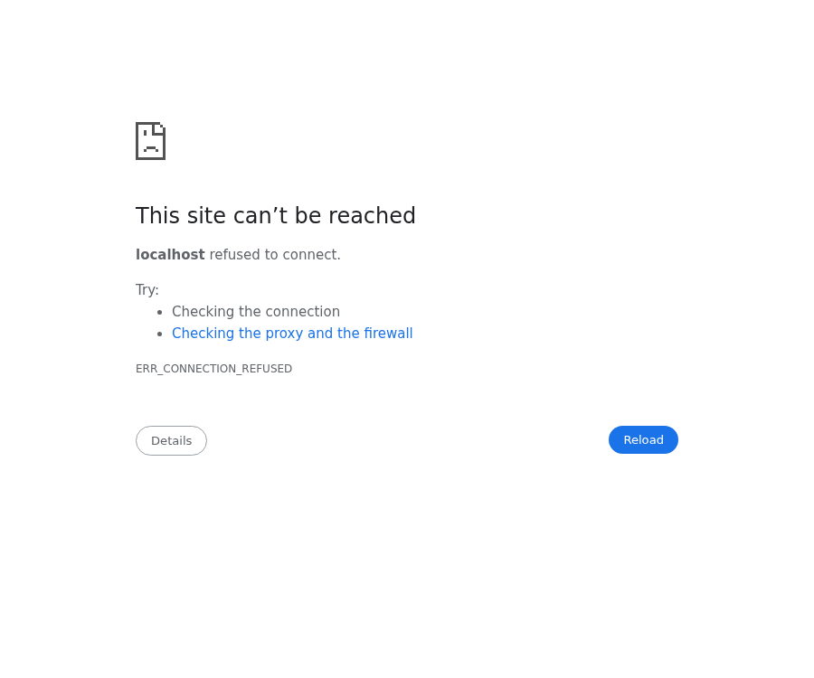

# 🐉 Dragon Curve Fractal Generator

[](https://makoclaw.github.io/dragon-curve-fractal/)
[](LICENSE)

> An interactive, animated visualization of the Heighway dragon curve — a self-similar fractal born from folding paper.

## 🌟 Live Demo

**[→ Try it here: makoclaw.github.io/dragon-curve-fractal](https://makoclaw.github.io/dragon-curve-fractal/)**

## 📸 Screenshot



## ✨ Features

- **Animated progressive drawing** — watch the fractal grow segment by segment with a glowing tip
- **6 color palettes** — Aurora, Fire, Ocean, Rainbow, Neon, Monochrome
- **Iteration range 1–20** — from a simple L-shape to ~1 million segments
- **Adjustable animation speed** — meditative slow-mo to instant render
- **Line width control** — fine detail or bold strokes
- **Auto-animate mode** — watch iterations cycle from 1→18 and back
- **Responsive design** — works on desktop, tablet, and mobile
- **Glassmorphism UI** — frosted glass control panel with gradient header
- **Zero dependencies** — pure vanilla HTML, CSS, and JavaScript

## 🧬 What is the Dragon Curve?

The **dragon curve** (also known as the Heighway dragon) is a space-filling fractal. It can be created by folding a strip of paper in half repeatedly, then unfolding each fold to a 90° angle. After *n* folds, the edge trace forms the *n*th iteration.

### L-System Definition

| Rule | Description |
|------|-------------|
| **Axiom** | `FX` |
| **Rule X** | `X → X+YF+` |
| **Rule Y** | `Y → -FX-Y` |

Where `F` = draw forward, `+` = turn right 90°, `-` = turn left 90°.

This implementation uses the equivalent **iterative turn-sequence** approach: each iteration doubles the number of segments, with each new segment's direction determined by the folded-paper pattern.

## 🚀 Quick Start

```bash
# Clone the repo
git clone https://github.com/makoclaw/dragon-curve-fractal.git
cd dragon-curve-fractal

# Option 1: Open directly in your browser
open index.html          # macOS
xdg-open index.html      # Linux
start index.html         # Windows

# Option 2: Serve locally
python3 -m http.server 8080
# Then visit http://localhost:8080
```

**No build tools, no `npm install`, no dependencies.** Just open `index.html`.

## 🎛️ Controls

| Control | Range | Description |
|---------|-------|-------------|
| **Iterations** | 1–20 | Fractal depth (higher = more detail) |
| **Speed** | 1–50 | Animation speed (segments per frame) |
| **Color Scheme** | 6 palettes | Aurora, Fire, Ocean, Rainbow, Neon, Monochrome |
| **Line Width** | 0.5–5 px | Stroke thickness |
| **Draw** | — | Start/pause the animation |
| **Reset** | — | Clear canvas and restart |
| **Animate** | — | Auto-cycle through iterations |

## 📊 Iteration Guide

| Iterations | Segments | Best For |
|-----------|----------|----------|
| 1–5 | 2–32 | Understanding the pattern |
| 6–10 | 64–1,024 | Smooth animation |
| 11–15 | 2K–32K | Detailed exploration |
| 16–20 | 65K–1M | Static zoom-out (use high speed) |

## 🏗️ Project Structure

```
├── index.html      # Main application (Canvas + UI)
├── dragon.js       # Fractal computation engine
├── style.css       # Glassmorphism styling
├── vercel.json     # Vercel deployment config
├── screenshot.png  # Preview image
└── README.md       # This file
```

## 🔧 Technical Details

- **Rendering**: HTML5 `<canvas>` with 2D context
- **Fractal algorithm**: Iterative L-system turn-sequence generation
- **Animation**: `requestAnimationFrame` with configurable segment budget per frame
- **Color interpolation**: Linear gradient mapping across iteration points
- **Responsive**: Canvas auto-resizes to viewport, controls stack on mobile

## 📜 License

MIT — use, modify, and share freely.

## 🤝 Contributing

Pull requests welcome! Ideas for contributions:
- Add new color palettes
- Export canvas as PNG/SVG
- Zoom and pan controls
- 3D dragon curve variant
- Julia set / Mandelbrot explorer mode
